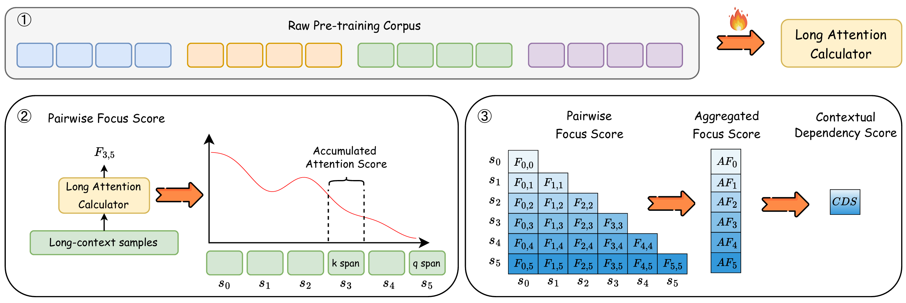

# LADM: Long-context Training Data Selection with Attention-based Dependency Measurement for LLMs
<p align="center">
    📖 <a href="https://arxiv.org/abs/2503.02502" target="_blank">Paper</a> • 🤗 <a href="https://huggingface.co/collections/UltraRonin/ladm-68466cbccb652c8d828ca17e" target="_blank">HF Repo</a>
</p>

## 🔍 Table of Contents
- [🌐 Overview](#overview)
- [📚 Preparation](#preparation)
- [⏳ Data Selection](#data_selection)
- [📝 Citation](#citation)


<a name="overview"></a>

## 🌐 Overview

Long-context modeling has drawn more and more attention in the area of Large Language Models (LLMs). Continual training with long-context data becomes the de-facto method to equip LLMs with the ability to process long inputs. However, it still remains an open challenge to measure the quality of long-context training data. To address this issue, we propose a **L**ong-context data selection framework with **A**ttention-based **D**ependency **M**easurement (**LADM**), which can efficiently identify high-quality long-context data from a large-scale, multi-domain pre-training corpus. LADM leverages the retrieval capabilities of the attention mechanism to capture contextual dependencies, ensuring a comprehensive quality measurement of long-context data. Experimental results show that our LADM framework significantly boosts the performance of LLMs on multiple long-context tasks with only 1B tokens for continual training.



<a name="preparation"></a>

## 📚 Preparation

### Data Preparation
Please prepare long-context pre-training dataset truncated to 32k tokens like following format, see [here](https://huggingface.co/datasets/UltraRonin/pile-LlamaTokenizerFast-32k-truncated-toy) for examples.
```
DatasetDict({
    train: Dataset({
        features: ['text', 'meta', 'input_ids', 'index'],
        num_rows: 32
    })
})
```

### Model Preparation
You can use our [Long Attention Calculator](https://huggingface.co/UltraRonin/Long-Attn-Calculator) or other LLMs with long-context modeling capability.


<a name="data_selection"></a>

## ⏳ Data Selection

If you run this script with our [toy dataset](https://huggingface.co/datasets/UltraRonin/pile-LlamaTokenizerFast-32k-truncated-toy), you will get similar CDS scores in file [./toy_scores.json](https://github.com/ZNLP/LADM/blob/main/toy_scores.json).

```bash
bash launch_toy.sh
```

For fully usage:
```bash
bash launch.sh
```

<a name="citation"></a>

## 📝 Citation

If you find this repo useful for your research, please consider citing the paper:
```
@article{chen2025ladm,
  title={LADM: Long-context Training Data Selection with Attention-based Dependency Measurement for LLMs},
  author={Chen, Jianghao and Wu, Junhong and Xu, Yangyifan and Zhang, Jiajun},
  journal={arXiv preprint arXiv:2503.02502},
  year={2025}
}
```